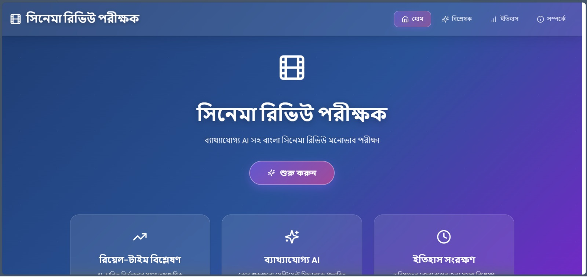
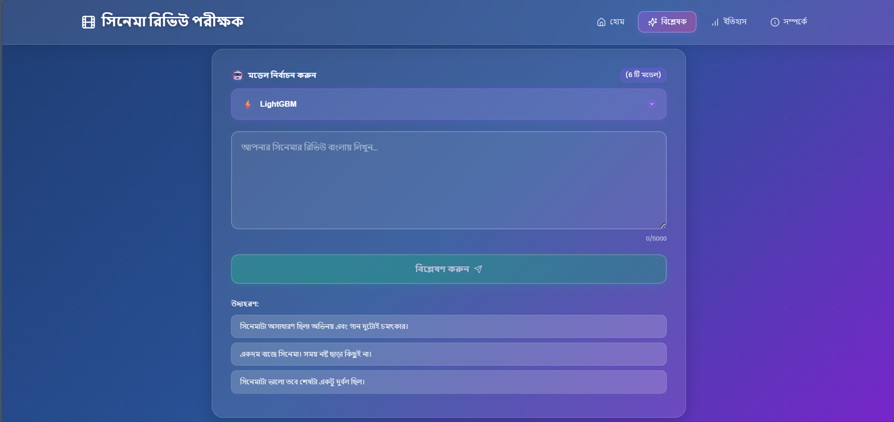
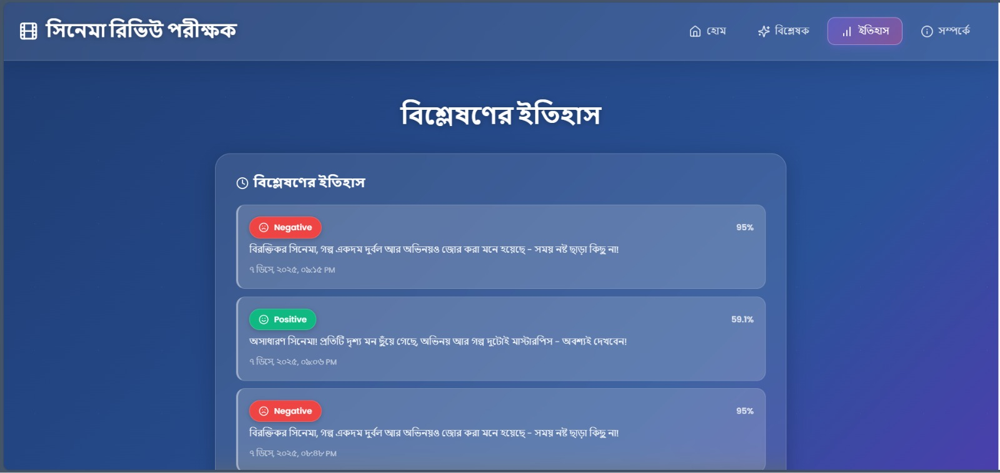
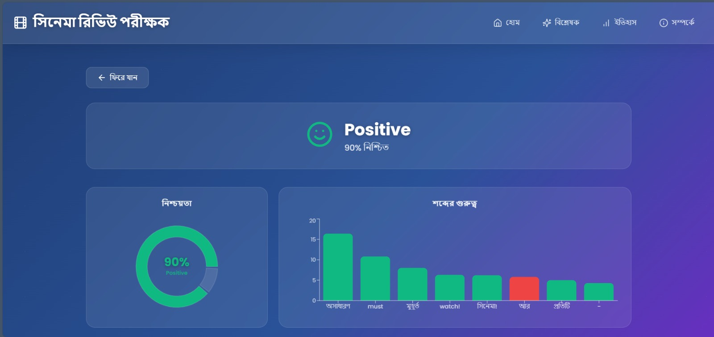
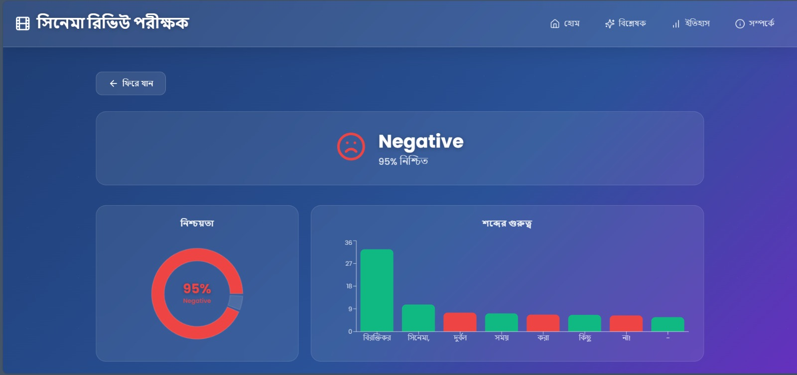

# 🎬 Bangla Movie Reviewer

A full-stack web application for sentiment analysis of Bangla movie reviews using 6 different machine learning models.


---

## ✨ Features

- 🤖 **6 ML Models** - Choose from Transformer, Deep Learning, and Classical ML models
- 🇧🇩 **Bangla Support** - Optimized for Bangla language sentiment analysis
- 🎨 **Beautiful UI** - Modern gradient theme with custom dropdown
- 📊 **Word Highlighting** - See which words influenced the prediction
- 📈 **Confidence Scores** - Get prediction confidence percentages
- 📜 **Analysis History** - Track your previous analyses
- ⚡ **Fast & Responsive** - Smooth animations and instant feedback

---

## 🚀 Quick Start

### One Command Setup:

```bash
git clone <your-repo-url>
cd BanglaMovieReviewer
.\start.bat
```

**That's it!** Browser opens at http://localhost:3000

---

## 🤖 Available Models

| Model | Type | Icon | Description |
|-------|------|------|-------------|
| **BanglaBERT** | Transformer | 🇧🇩 | Fine-tuned BERT for Bangla |
| **mBERT** | Transformer | 🌍 | Multilingual BERT |
| **CNN** | Deep Learning | 🧠 | Convolutional Neural Network |
| **Masked_LSTM** | Deep Learning | 🔄 | Recurrent Neural Network |
| **LightGBM** | Classical ML | ⚡ | Gradient Boosting |
| **Logistic Regression** | Classical ML | 📊 | Linear Classifier |

All models hosted on Hugging Face: [`shksabbir7`](https://huggingface.co/shksabbir7)

---

## 📸 Screenshots

### Home Page


### Analyzer with Model Dropdown


### History Page


### Positive Result


### Negative Result


---

## 🛠️ Tech Stack

### Backend:
- **Framework:** Django 4.2.7
- **API:** Django REST Framework
- **ML Libraries:** Transformers, TensorFlow, PyTorch, LightGBM, Scikit-learn
- **Model Hub:** Hugging Face Hub
- **Database:** SQLite

### Frontend:
- **Framework:** React 18.2
- **HTTP Client:** Axios
- **Icons:** Lucide React
- **Routing:** React Router
- **Styling:** Custom CSS with gradients

---

## 📋 Prerequisites

- **Python:** 3.8 or higher
- **Node.js:** 14 or higher
- **RAM:** 4GB minimum (8GB recommended)
- **Internet:** Required for first run (model download)

---

## 🔧 Installation

### Option 1: Automated Setup (Recommended)

```bash
# Clone repository
git clone <your-repo-url>
cd BanglaMovieReviewer

# Run setup script (first time: 10-15 minutes)
.\run_all.bat
```

### Option 2: Manual Setup

#### Backend:
```bash
cd backend
python -m venv venv
call venv\Scripts\activate.bat
pip install -r requirements.txt
python manage.py migrate
python manage.py runserver
```

#### Frontend:
```bash
cd frontend
npm install
npm start
```

---

## 🎯 Usage

1. **Start Application:**
   ```bash
   .\start.bat
   ```

2. **Open Browser:** http://localhost:3000

3. **Select Model:** Choose from dropdown (6 models)

4. **Enter Review:** Type Bangla movie review (max 5000 chars)

5. **Analyze:** Click "বিশ্লেষণ করুন"

6. **View Results:**
   - Sentiment (Positive/Negative/Neutral)
   - Confidence percentage
   - Word importance scores
   - Color-coded word highlighting

---

## 🧪 Testing

### Automated Tests:
```bash
cd backend
call venv\Scripts\activate.bat
python auto_test.py
```

**Tests Include:**
- ✅ Backend connection
- ✅ Model availability (6 models)
- ✅ Valid analysis
- ✅ Input validation
- ✅ Edge cases
- ✅ All models working

**Expected:** 7/7 tests pass

---

## 📁 Project Structure

```
BanglaMovieReviewer/
├── backend/              # Django backend
│   ├── sentiment_api/   # Main API app
│   ├── config/          # Django settings
│   └── requirements.txt # Python dependencies
├── frontend/            # React frontend
│   ├── src/            # Source code
│   └── package.json    # Node dependencies
├── docs/               # Documentation
├── screenshots/        # UI screenshots
├── start.bat          # Quick start script
└── run_all.bat        # Full setup script
```

**Detailed Structure:** See [PROJECT_DOCUMENTATION.md](PROJECT_DOCUMENTATION.md)

---

## 🌐 API Endpoints

### Base URL: `http://localhost:8000/api/sentiment`

| Method | Endpoint | Description |
|--------|----------|-------------|
| GET | `/models/` | List available models |
| POST | `/analyze/` | Analyze sentiment |
| GET | `/history/` | Get analysis history |

**Full API Docs:** See [docs/API_DOCUMENTATION.md](docs/API_DOCUMENTATION.md)

---

## 🎨 Features in Detail

### Custom Model Dropdown:
- 🎯 6 models with unique icons
- 💫 Smooth animations
- 🎨 Gradient background
- ✨ Hover effects
- 🔍 Active state highlighting

### Input Validation:
- ✅ Empty text detection
- ✅ Character limit (5000)
- ✅ Real-time counter
- ✅ Error messages in Bangla

### Results Display:
- 📊 Sentiment classification
- 💯 Confidence percentage
- 🎨 Word highlighting
- 📈 Importance scores
- 🔄 Easy model switching

---

## 🚀 Deployment

### Hugging Face Models:
All models automatically download from Hugging Face on first use. No large files in repository!

### Environment Variables:
```bash
DJANGO_SECRET_KEY=your-secret-key
DEBUG=False
ALLOWED_HOSTS=your-domain.com
```

### Deploy to:
- Heroku
- Railway
- Render
- AWS
- Google Cloud

**Deployment Guide:** See [docs/DEPLOYMENT.md](docs/DEPLOYMENT.md)

---

## 📚 Documentation

- **[PROJECT_DOCUMENTATION.md](PROJECT_DOCUMENTATION.md)** - Complete project overview
- **[SETUP_GUIDE.md](SETUP_GUIDE.md)** - Detailed setup instructions
- **[docs/API_DOCUMENTATION.md](docs/API_DOCUMENTATION.md)** - API reference
- **[docs/TROUBLESHOOTING.md](docs/TROUBLESHOOTING.md)** - Common issues

---

## 🤝 Contributing

1. Fork the repository
2. Create feature branch (`git checkout -b feature/AmazingFeature`)
3. Commit changes (`git commit -m 'Add AmazingFeature'`)
4. Push to branch (`git push origin feature/AmazingFeature`)
5. Open Pull Request

---

## 🐛 Troubleshooting

### Backend won't start:
```bash
cd backend
call venv\Scripts\activate.bat
pip install -r requirements.txt
python manage.py migrate
```

### Frontend won't start:
```bash
cd frontend
npm install
npm start
```

### Models not downloading:
- Check internet connection
- Verify Hugging Face is accessible
- Wait patiently (first download takes 2-3 min per model)

**More Solutions:** See [docs/TROUBLESHOOTING.md](docs/TROUBLESHOOTING.md)

---

## 📊 Model Performance

| Model | Accuracy | Speed | Size |
|-------|----------|-------|------|
| BanglaBERT | ⭐⭐⭐⭐⭐ | ⭐⭐⭐ | Large |
| mBERT | ⭐⭐⭐⭐ | ⭐⭐⭐ | Large |
| CNN | ⭐⭐⭐⭐ | ⭐⭐⭐⭐ | Medium |
| Masked_LSTM | ⭐⭐⭐⭐ | ⭐⭐⭐ | Medium |
| LightGBM | ⭐⭐⭐ | ⭐⭐⭐⭐⭐ | Small |
| Logistic Regression | ⭐⭐⭐ | ⭐⭐⭐⭐⭐ | Small |

---

## 📝 License

This project is licensed under the MIT License - see the [LICENSE](LICENSE) file for details.

---

## 👨💻 Author

**Hugging Face Models:** [shksabbir7](https://huggingface.co/shksabbir7)

**Models:**
- [bangla-movie-sentiment-banglabert](https://huggingface.co/shksabbir7/bangla-movie-sentiment-banglabert)
- [bangla-movie-sentiment-mbert](https://huggingface.co/shksabbir7/bangla-movie-sentiment-mbert)
- [bangla-movie-sentiment-cnn](https://huggingface.co/shksabbir7/bangla-movie-sentiment-cnn)
- [bangla-movie-sentiment-lstm](https://huggingface.co/shksabbir7/bangla-movie-sentiment-lstm)
- [bangla-movie-sentiment-lightgbm](https://huggingface.co/shksabbir7/bangla-movie-sentiment-lightgbm)
- [bangla-movie-sentiment-logreg](https://huggingface.co/shksabbir7/bangla-movie-sentiment-logreg)

---

## 🙏 Acknowledgments

- Hugging Face for model hosting
- Django & React communities
- Bangla NLP community
- All contributors

---

## 📞 Support

- **Issues:** [GitHub Issues](your-repo/issues)
- **Documentation:** [docs/](docs/)
- **Email:** your-email@example.com

---

## 🎉 Quick Commands

```bash
# First time setup
.\run_all.bat

# Daily usage
.\start.bat

# Run tests
cd backend && python auto_test.py

# Stop servers
# Close both terminal windows
```

---

**Made with ❤️ for Bangla NLP**

**Star ⭐ this repo if you find it useful!**
