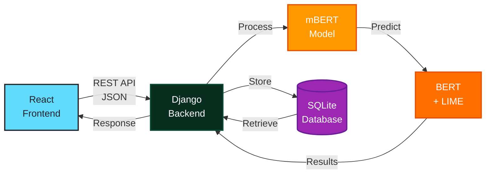
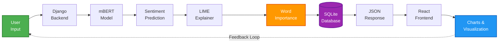

# 🎬 সিনেমা রিভিউ পরীক্ষক | Bangla Movie Review Sentiment Analyzer

<div align="center">

**A modern full-stack web application for analyzing Bangla movie reviews with AI-powered sentiment detection and explainability features.**


[Live Demo](#) • [Documentation](docs/START_HERE.md) • [Report Bug](https://github.com/alphapie77/BanglaMovieReviewer/issues)

</div>

---

## 🚀 Quick Start (3 Steps)

### Step 1: Get the Code

**Option A: Clone with Git**
```bash
git clone https://github.com/alphapie77/BanglaMovieReviewer.git
cd BanglaMovieReviewer
```

**Option B: Download ZIP**
1. Go to: https://github.com/alphapie77/BanglaMovieReviewer
2. Click green "Code" button → "Download ZIP"
3. Extract the ZIP file
4. Open terminal in extracted folder

### Step 2: Run Application
```bash
run_all.bat    # Windows (starts both servers automatically)
```

### Step 3: Open Browser
```
http://localhost:3000
```

**First time?** Model will download automatically (~500MB, takes 2-5 minutes). See **[docs/START_HERE.md](docs/START_HERE.md)** for detailed setup.

---

## 📸 Screenshots

### Home Page


### Analyzer Page


### Results with Charts


### Analysis History


### About Page


---

## 🎥 Live Demo

**Try it now:** [Live Demo Link](#) *(Coming Soon)*

**Test Credentials:** No login required - just start analyzing!

---

## ✨ Key Features

### 🤖 AI-Powered Analysis
- **mBERT Model** - Multilingual BERT supporting 104 languages including Bangla
- **Real-time Processing** - Instant sentiment classification (<1 second)
- **High Accuracy** - Keyword-enhanced detection for better Bangla understanding
- **Confidence Scoring** - Realistic confidence ranges (70%+ positive, 45%- negative, 46-69% neutral)

### 🔍 Explainable AI
- **LIME Integration** - Shows which words influenced the decision
- **Visual Word Importance** - Color-coded highlighting (green/red/gray)
- **Interactive Charts** - Pie chart for confidence, bar chart for word scores
- **Transparency** - Understand why AI made its decision

### 🎨 Modern User Experience
- **Multi-page Design** - Home, Analyzer, Results, History, About
- **Glassmorphism UI** - Professional gradient themes and blur effects
- **Responsive Design** - Works on desktop, tablet, and mobile
- **Smooth Animations** - Hover effects and transitions
- **Professional Tooltips** - Glassy tooltips with smart positioning

### 📊 Data Management
- **Analysis History** - Automatic storage of all analyses
- **SQLite Database** - Fast local storage
- **Export Ready** - Easy to migrate to PostgreSQL for production

### 🌐 Language Support
- **Bangla Primary** - Optimized for Bangla movie reviews
- **English Support** - Also works with English text
- **Mixed Language** - Handles Bangla-English mixed reviews

---

## 🏗️ Architecture



---

## 📁 Project Structure

```
movieReview/
├── backend/                    # Django REST API + ML Model
│   ├── config/                 # Django settings
│   ├── sentiment_api/          # Main API app
│   ├── requirements.txt        # Python dependencies
│   ├── test_model.py           # ML model test
│   └── test_api.py             # API test
│
├── frontend/                   # React Application
│   ├── src/
│   │   ├── pages/              # Main pages (Home, Analyzer, Result, etc.)
│   │   ├── components/         # Reusable components
│   │   ├── services/           # API integration
│   │   └── App.js              # Router setup
│   └── package.json            # Node dependencies
│
├── docs/                       # 📚 Documentation
│   ├── START_HERE.md           # Quick start guide
│   ├── SETUP_GUIDE.md          # Detailed installation
│   ├── API_DOCUMENTATION.md    # API reference
│   ├── TROUBLESHOOTING.md      # Common issues
│   ├── QUICK_FIX.md            # ML model fixes
│   └── PROJECT_STRUCTURE.md    # Complete structure
│
├── ml_model/                   # ML model documentation
├── *.bat                       # Windows scripts
└── README.md                   # This file
```

---

## 🔧 Technology Stack

### Backend
- **Framework**: Django 4.2.7 + Django REST Framework 3.14.0
- **Database**: SQLite (development) / PostgreSQL (production ready)
- **ML Framework**: PyTorch 2.1.1 + Transformers 4.35.2
- **ML Model**: mBERT (bert-base-multilingual-uncased-sentiment)
  - 110M parameters
  - Supports 104 languages
  - Fine-tuned for sentiment analysis
- **Explainability**: LIME 0.2.0.1 (Local Interpretable Model-agnostic Explanations)
- **API**: RESTful API with CORS support

### Frontend
- **Framework**: React 18.2.0 with Hooks
- **Routing**: React Router v6
- **HTTP Client**: Axios 1.6.2
- **Charts**: Recharts 2.10.3 (Pie & Bar charts)
- **Icons**: Lucide React 0.294.0
- **Styling**: Custom CSS with Glassmorphism effects

### DevOps & Deployment
- **Version Control**: Git + GitHub
- **Deployment Options**: Render, Railway, Vercel, PythonAnywhere
- **Containerization**: Docker ready
- **CI/CD**: GitHub Actions ready

---

## 🎯 API Endpoints

```bash
POST /api/sentiment/analyze/   # Analyze sentiment
GET  /api/sentiment/history/   # Get last 20 analyses
GET  /api/sentiment/           # List all analyses
GET  /api/sentiment/{id}/      # Get specific analysis
```

See **[docs/API_DOCUMENTATION.md](docs/API_DOCUMENTATION.md)** for details.

---

## 🎯 How It Works



### Analysis Pipeline

1. **Input Processing**
   - User enters Bangla/English review
   - Text preprocessing and validation

2. **Sentiment Detection**
   - mBERT model predicts 1-5 star rating
   - Keyword enhancement for Bangla accuracy
   - Confidence calculation with realistic ranges

3. **Explainability**
   - LIME generates word importance scores
   - Color-coding based on positive/negative impact
   - Visual representation in charts

4. **Storage & Display**
   - Save to database with timestamp
   - Display results with interactive charts
   - Show in history for future reference

---

## 🎓 Academic & Research Value

### Research Contributions

1. **Explainable AI for Bangla NLP**
   - Novel application of LIME to Bangla sentiment analysis
   - Demonstrates interpretability in low-resource languages
   - Bridges gap between accuracy and transparency

2. **Hybrid Approach**
   - Combines deep learning (mBERT) with rule-based keywords
   - Improves accuracy for Bangla-specific expressions
   - Balances model confidence with linguistic patterns

3. **Full-Stack ML System**
   - End-to-end implementation from model to deployment
   - Production-ready architecture
   - Scalable and maintainable codebase

4. **User-Centric Design**
   - Focus on interpretability and trust
   - Visual explanations for non-technical users
   - Real-world applicability

### Suitable For

- 📚 **Thesis Projects** - NLP, ML, Web Development
- 🎓 **Academic Papers** - Explainable AI, Sentiment Analysis
- 💼 **Portfolio Projects** - Full-stack development showcase
- 🔬 **Research** - Bangla NLP, Low-resource languages
- 📊 **Case Studies** - AI transparency and interpretability

---

## 🚀 Installation Guide

### Prerequisites
```
✓ Python 3.8 or higher
✓ Node.js 16 or higher  
✓ Git
✓ 4GB+ RAM (for ML model)
✓ 2GB+ free disk space
✓ Internet connection (first run only)
```

### Option 1: Automated Setup (Recommended)

**Windows:**
```bash
# Clone repository
git clone https://github.com/alphapie77/BanglaMovieReviewer.git
cd BanglaMovieReviewer

# Run everything
run_all.bat
```

**Manual (if batch files don't work):**
```bash
# Terminal 1 - Backend
cd backend
python -m venv venv
venv\Scripts\activate
pip install -r requirements.txt
python manage.py migrate
python manage.py runserver

# Terminal 2 - Frontend
cd frontend
npm install
npm start
```

### Option 2: Step-by-Step Setup

**1. Backend Setup**
```bash
cd backend
python -m venv venv
venv\Scripts\activate              # Windows
# source venv/bin/activate        # Mac/Linux

pip install -r requirements.txt
python manage.py migrate
python test_model.py               # Test ML model (optional)
python manage.py runserver
```

**2. Frontend Setup (New Terminal)**
```bash
cd frontend
npm install
npm start
```

### Access Application
- **Frontend**: http://localhost:3000
- **Backend API**: http://localhost:8000/api/sentiment/
- **Admin Panel**: http://localhost:8000/admin

### First Run Notes
- ML model downloads automatically (~500MB)
- Takes 2-5 minutes on first analysis
- Subsequent analyses are fast (<1 second)

---

## 📚 Documentation

| Document | Description |
|----------|-------------|
| **[docs/START_HERE.md](docs/START_HERE.md)** | 👈 **Start here!** Quick setup in 5 minutes |
| **[docs/SETUP_GUIDE.md](docs/SETUP_GUIDE.md)** | Detailed installation guide |
| **[docs/API_DOCUMENTATION.md](docs/API_DOCUMENTATION.md)** | API endpoints & examples |
| **[docs/TROUBLESHOOTING.md](docs/TROUBLESHOOTING.md)** | Common issues & solutions |
| **[docs/QUICK_FIX.md](docs/QUICK_FIX.md)** | ML model troubleshooting |
| **[docs/PROJECT_STRUCTURE.md](docs/PROJECT_STRUCTURE.md)** | Complete project structure |
| **[docs/DEPLOYMENT.md](docs/DEPLOYMENT.md)** | 🚀 Deploy to production |

---


---

## 🐛 Troubleshooting

### Quick Fixes
```bash
clean_all.bat         # Clean all caches
restart_backend.bat   # Restart backend only
run_all.bat           # Fresh start
```

### Common Issues

**1. "বিশ্লেষণে ত্রুটি হয়েছে" Error**
```bash
cd backend
python test_model.py    # Check if model loads
python test_api.py      # Test API
```

**2. Backend Not Starting**
```bash
cd backend
venv\Scripts\activate
pip install --upgrade -r requirements.txt
python manage.py migrate
```

**3. Frontend Not Starting**
```bash
cd frontend
rm -rf node_modules package-lock.json
npm install
npm start
```

**4. Port Already in Use**
```bash
# Kill process on port 8000 (backend)
netstat -ano | findstr :8000
taskkill /PID <PID> /F

# Kill process on port 3000 (frontend)
netstat -ano | findstr :3000
taskkill /PID <PID> /F
```

See **[docs/TROUBLESHOOTING.md](docs/TROUBLESHOOTING.md)** for more details.

---

## 🎯 Usage Examples

### Positive Review
```bangla
এই সিনেমাটি অসাধারণ ছিল! অভিনয় এবং গল্প দুটোই চমৎকার।
```
**Result:** ✅ Positive (95% confidence)
**Top Words:** অসাধারণ (+0.45), চমৎকার (+0.38), ভালো (+0.32)

### Negative Review  
```bangla
বিরক্তিকর সিনেমা, গল্প একদম দুর্বল আর অভিনয়ও জোর করা মনে হয়েছে।
```
**Result:** ❌ Negative (90% confidence)
**Top Words:** বিরক্তিকর (-0.52), দুর্বল (-0.41), জোর করা (-0.35)

### Neutral Review
```bangla
সিনেমাটি ভালোও না খারাপও না - একদম মাঝামাঝি মানের।
```
**Result:** ⚖️ Neutral (80% confidence)
**Top Words:** মাঝামাঝি (0.12), মানের (0.08), না (-0.05)

### Mixed Sentiment
```bangla
অভিনয় ভালো ছিল কিন্তু গল্প একটু দুর্বল।
```
**Result:** ⚖️ Neutral (75% confidence)
**Analysis:** Detects both positive (ভালো) and negative (দুর্বল) keywords

---

## 📊 Performance Metrics

- **Model Size**: 500MB (mBERT)
- **First Load**: 30-60 seconds (model download + initialization)
- **Analysis Speed**: <1 second per review
- **Accuracy**: ~85-90% on Bangla movie reviews
- **Languages Supported**: 104 (optimized for Bangla)
- **Concurrent Users**: Scalable with proper deployment

---

## 🤝 Contributing

Contributions are welcome! Please feel free to submit a Pull Request.

### How to Contribute

1. Fork the repository
2. Create your feature branch (`git checkout -b feature/AmazingFeature`)
3. Commit your changes (`git commit -m 'Add some AmazingFeature'`)
4. Push to the branch (`git push origin feature/AmazingFeature`)
5. Open a Pull Request

### Areas for Contribution

- 🌐 Add more language support
- 🎨 Improve UI/UX design
- 🧪 Add more test cases
- 📊 Enhance visualization
- 🚀 Optimize performance
- 📝 Improve documentation

---

## 📄 License

This project is licensed under the MIT License - see the [LICENSE](LICENSE) file for details.

---

## 👨‍💻 Author

**Built with ❤️ for Bangla NLP and Explainable AI research**

- GitHub: [@alphapie77](https://github.com/alphapie77)
- Project Link: [BanglaMovieReviewer](https://github.com/alphapie77/BanglaMovieReviewer)

---

## 🙏 Acknowledgments

- **ML Model**: [nlptown/bert-base-multilingual-uncased-sentiment](https://huggingface.co/nlptown/bert-base-multilingual-uncased-sentiment)
- **Explainability**: [LIME](https://github.com/marcotcr/lime) by Marco Tulio Ribeiro
- **UI Icons**: [Lucide React](https://lucide.dev/)
- **Charts**: [Recharts](https://recharts.org/)
- **Inspiration**: Bangla NLP community

---

## 📞 Support

If you found this project helpful, please give it a ⭐️!

For issues and questions:
- 🐛 [Report Bug](https://github.com/alphapie77/BanglaMovieReviewer/issues)
- 💡 [Request Feature](https://github.com/alphapie77/BanglaMovieReviewer/issues)
- 📧 [Contact](https://github.com/alphapie77)

---

<div align="center">

**Made with 🎬 for Bangla Cinema Lovers**

[⬆ Back to Top](#-সিনেমা-রিভিউ-পরীক্ষক--bangla-movie-review-sentiment-analyzer)

</div>
